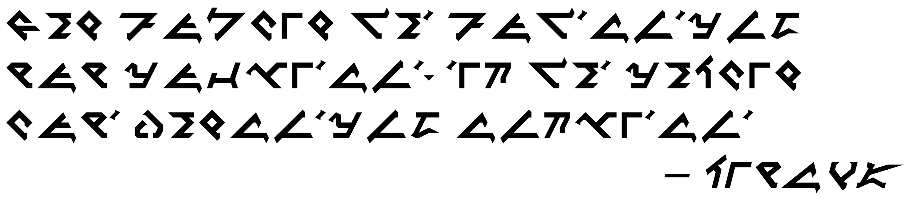

An open source font implementing [pIqaD](https://www.evertype.com/standards/csur/klingon.html). A klingon writing system.

## Demo



## Included Glyphs

 ⇲     | 0			| 1			| 2			| 3			| 4			| 5			| 6			| 7			| 8			| 9			| A			| B			| C			| D			| E			| F
------:|------------|-----------|-----------|-----------|-----------|-----------|-----------|-----------|-----------|-----------|-----------|-----------|-----------|-----------|-----------|--------
U+F8Dx | ![][]	| ![][]	| ![][]	| ![][]	| ![][]	| ![][]	| ![][]	| ![][]	| ![][]	| ![][]	| ![][]	| ![][]	| ![][]	| ![][]	| ![][]	| ![][]
U+F8Ex | ![][]	| ![][]	| ![][]	| ![][]	| ![][]	| ![][]	| ![][]	| ![][]	| ![][]	| ![][]		|			|			|			| 			|			|		
U+F8Fx | ![][]	| ![][]	| ![][]	| ![][]	| ![][]		| ![][]	| ![][]	| ![][]	| ![][]	| ![][]	|			|			|			| ![][]		| ![][]		| ![][]

[]: png/uF8D0-.png ""
[]: png/uF8D3-.png ""
[]: png/uF8D6-.png ""
[]: png/uF8D9-.png ""
[]: png/uF8DC-.png ""
[]: png/uF8DF-.png ""
[]: png/uF8E2-.png ""
[]: png/uF8E5-.png ""
[]: png/uF8E8-.png ""
[]: png/uF8F1-.png ""
[]: png/uF8F4-.png ""
[]: png/uF8F7-.png ""
[]: png/uF8FD-.png ""
[]: png/uF8D1-.png ""
[]: png/uF8D4-.png ""
[]: png/uF8D7-.png ""
[]: png/uF8DA-.png ""
[]: png/uF8DD-.png ""
[]: png/uF8E0-.png ""
[]: png/uF8E3-.png ""
[]: png/uF8E6-.png ""
[]: png/uF8E9-.png ""
[]: png/uF8F2-.png ""
[]: png/uF8F5-.png ""
[]: png/uF8F8-.png ""
[]: png/uF8FE-.png ""
[]: png/uF8D2-.png ""
[]: png/uF8D5-.png ""
[]: png/uF8D8-.png ""
[]: png/uF8DB-.png ""
[]: png/uF8DE-.png ""
[]: png/uF8E1-.png ""
[]: png/uF8E4-.png ""
[]: png/uF8E7-.png ""
[]: png/uF8F0-.png ""
[]: png/uF8F3-.png ""
[]: png/uF8F6-.png ""
[]: png/uF8F9-.png ""
[]: png/uF8FF-.png ""

## Use it on the web!

```css
@font-face {
  font-family: 'DIn pIqaD';
  src: url(dist/DIn pIqaD.woff);
  unicode-range: U+F8D0-F8E9,U+F8F0-F8F9,U+F8FD-F8FF;
}

body {
  font-family: 'DIn pIqaD', fantasy;
}
```
